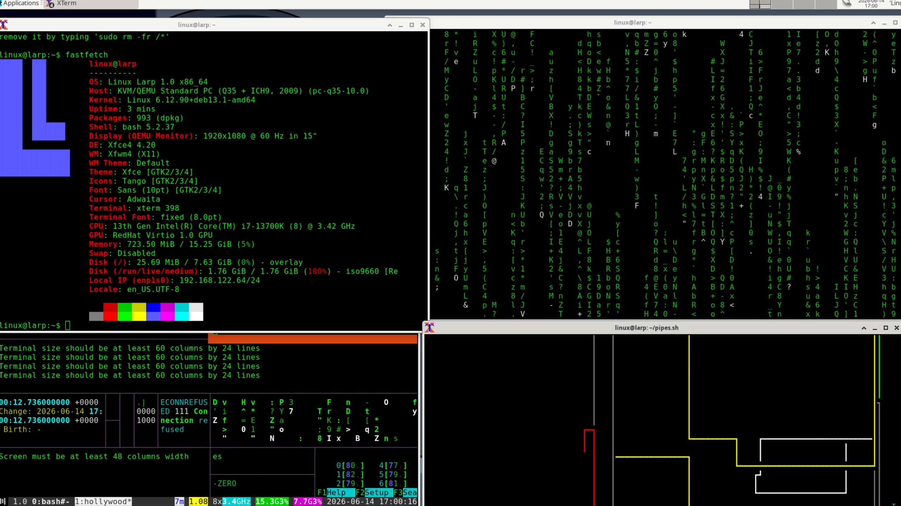

# Linux LARP Now Has a Working hackermode on Shell!

<p align="center">
  
</p>


## [CLICK HERE TO WATCH THE VIDEO SHOWCASE OF LINUX LARP](https://youtu.be/FRgE8DjzMAs)

---

<p>
  <b>hackermode.sh</b> is made based on a parody Debian-based distro Larp Linux. Now you can use it on your shell without downloading .iso file!
</p>

---


## Download

```bash
HTTPS://github.com/semihkalkandelen/hackermode.sh.git

```

## Make It Executable

```bash
chmod +x hackermode.sh
```

## Run

~~~bash
./hackermode.sh
~~~

## NOTES
<p>
  Just in case, I decide to remove dash and star on french langue although it just print the text on screen.
  
  Using a black backround terminal is recommended.
  </p>

## HAPPY LARPING
